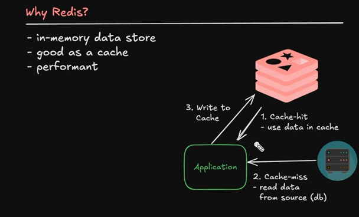

RUN REDIS CONTAINER
``` sh 
    docker-compose up -d
```
INSTALLING PACKAGE 
``` sh 
    npm i 
```
RUNNING APP 
``` sh 
    npm run dev
```

# Belajar Redis

## Instalasi

### Metode
- **Docker**: Menggunakan Docker untuk menjalankan Redis dengan mudah.
- **Unduh Langsung**: Mengunduh Redis dari situs resmi dan menginstalnya di komputer.

##  Menggunakan Redis CLI

### Perintah Dasar
- **SET**
  SET key "Hello, Redis!"
- **GET**
  GET key
- **DEL**
  DEL key
- **KEYS**
  KEYS *

# Struktur Data Redis

### 1. Strings
- Deskripsi: Struktur data paling sederhana, dapat menyimpan teks, angka, atau binary.
- Contoh:
  SET name "Redis"
  GET name

### 2. Hashes
- Deskripsi: Koleksi pasangan kunci-nilai, ideal untuk menyimpan objek.
- Contoh:
  HSET user:1000 name "Alice" age 30
  HGET user:1000 name

### 3. Lists
- Deskripsi: Daftar terurut dari string, cocok untuk antrian.
- Contoh:
  LPUSH tasks "Task 1"
  RPUSH tasks "Task 2"
  LRANGE tasks 0 -1

### 4. Sets
- Deskripsi: Kumpulan string unik, cocok untuk menghindari duplikasi.
- Contoh:
  SADD unique_numbers 1 2 3 3
  SMEMBERS unique_numbers

### 5. Sorted Sets
- Deskripsi: Mirip dengan sets, tetapi setiap anggota memiliki skor yang menentukan urutan.
- Contoh:
  ZADD leaderboard 100 "Alice"
  ZADD leaderboard 200 "Bob"
  ZRANGE leaderboard 0 -1 WITHSCORES

### 6. Bitmaps
- Deskripsi: Struktur untuk menyimpan data bit, digunakan untuk menghitung dan melacak.
- Contoh:
  SETBIT user:1000:login 0 1
  GETBIT user:1000:login 0

### 7. HyperLogLogs
- Deskripsi: Struktur data probabilistik untuk menghitung estimasi jumlah unik.
- Contoh:
  PFADD page_views "user1" "user2" "user1"
  PFCOUNT page_views

### 8. Geospatial
- Deskripsi: Menyimpan dan mengelola data lokasi menggunakan koordinat.
- Contoh:
  GEOADD locations 13.361389 38.115556 "Palermo"
  GEORADIUS locations 15 37 200 km
